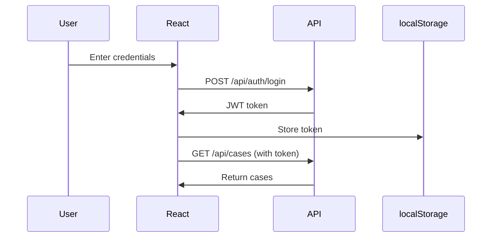

# Quick Start Guide: React + .NET Core Integration

## 🎯 Overview

You now have a **production-ready React frontend** that's fully prepared to integrate with a .NET Core backend API.

## 📋 What's Been Built

### ✅ React Frontend (Complete)
- Modern, professional UI with government-appropriate design
- Multiple pages: Dashboard, Cases, Workflows, Rules, etc.
- API service layer with TypeScript
- Authentication handling (JWT)
- Loading states and error handling
- Mock data mode for development

### 🔜 .NET Core Backend (You Need to Build)
- Web API with controllers
- Entity Framework Core for database
- JWT authentication
- CORS configuration

## 🚀 Getting Started

### Option 1: Development Mode (No Backend Required)

```bash
# 1. Install dependencies
npm install

# 2. Use mock data (no backend needed)
echo "VITE_USE_MOCK_DATA=true" > .env

# 3. Run the app
npm run dev

# App runs at: http://localhost:5173
```

**Perfect for:** Frontend development, UI testing, demos

### Option 2: Production Mode (With .NET Core Backend)

```bash
# 1. Build .NET Core API (see DOTNET-EXAMPLES.md)
cd ../GovFlowApi
dotnet run

# 2. Configure React to use real API
echo "VITE_API_BASE_URL=https://localhost:5001/api" > .env
echo "VITE_USE_MOCK_DATA=false" >> .env

# 3. Run React app
npm run dev
```

**Perfect for:** Production deployment, testing with real data

## 📁 Key Files to Know

### Frontend Files (React)

| File | Purpose |
|------|---------|
| `/src/app/services/*.service.ts` | API service classes (calls your .NET API) |
| `/src/app/config/api.config.ts` | API endpoint configuration |
| `/src/app/types/api.types.ts` | TypeScript interfaces (match your C# DTOs) |
| `/src/app/hooks/useApi.ts` | Custom hooks for API calls |
| `.env` | Environment variables (API URL, mock mode) |

### Backend Files (.NET Core) - You Create These

| File | Purpose |
|------|---------|
| `Controllers/CasesController.cs` | Case management endpoints |
| `DTOs/CaseDto.cs` | Data transfer objects |
| `Services/CaseService.cs` | Business logic |
| `Data/ApplicationDbContext.cs` | Database context |
| `Program.cs` | App configuration |

## 🔌 How They Connect

```
┌─────────────────────────────────────────┐
│  React Component (e.g., Dashboard)      │
│                                          │
│  Uses: useApi() hook                    │
└────────────────┬────────────────────────┘
                 │
                 ▼
┌─────────────────────────────────────────┐
│  Service Layer (e.g., caseService)      │
│                                          │
│  Calls: caseService.getCases()          │
└────────────────┬────────────────────────┘
                 │
                 ▼
┌─────────────────────────────────────────┐
│  API Client (apiClient.get())           │
│                                          │
│  HTTP GET to: /api/cases                │
│  Headers: Authorization: Bearer <token> │
└────────────────┬────────────────────────┘
                 │
                 │ HTTP Request
                 ▼
┌─────────────────────────────────────────┐
│  .NET Core API                          │
│                                          │
│  CasesController.GetCases()             │
│  Returns: JSON with cases               │
└─────────────────────────────────────────┘
```

## 🛠️ Common Tasks

### Switch Between Mock and Real API

```bash
# Use mock data (development)
echo "VITE_USE_MOCK_DATA=true" > .env

# Use real API (production)
echo "VITE_USE_MOCK_DATA=false" > .env
```

### Change API URL

```bash
# Local development
VITE_API_BASE_URL=https://localhost:5001/api

# Production
VITE_API_BASE_URL=https://api.yourcompany.com/api
```

### Add New API Endpoint

1. **Frontend:**
   - Add endpoint to `api.config.ts`
   - Add DTO interface to `api.types.ts`
   - Add method to service file

2. **Backend:**
   - Create C# controller action
   - Create DTO class
   - Implement service logic

## 📚 Documentation

| Document | What's Inside |
|----------|---------------|
| `API-INTEGRATION.md` | Complete integration guide |
| `DOTNET-EXAMPLES.md` | C# code examples |
| This file | Quick start guide |

## 🔐 Authentication Flow



## 🎨 Features Overview

### Dashboard
- **What:** Metrics, charts, recent activity
- **API Calls:** 
  - `GET /api/dashboard/metrics`
  - `GET /api/dashboard/activity`

### Case Management
- **What:** Search, filter, view all cases
- **API Calls:**
  - `GET /api/cases`
  - `GET /api/cases/{id}`
  - `POST /api/cases/{id}/approve`

### Workflow Pipeline
- **What:** Visual workflow stages
- **API Calls:**
  - `GET /api/workflows/{id}`
  - `POST /api/workflows/{id}/advance`

### Rules Engine
- **What:** Configure routing rules
- **API Calls:**
  - `GET /api/rules`
  - `POST /api/rules`
  - `PUT /api/rules/{id}`

## 🧪 Testing

### Test Frontend Only
```bash
# Run with mock data
VITE_USE_MOCK_DATA=true npm run dev
```

### Test Frontend + Backend
```bash
# Terminal 1: Run API
cd GovFlowApi && dotnet run

# Terminal 2: Run React
VITE_USE_MOCK_DATA=false npm run dev
```

### Check API Connection
```typescript
// In browser console
fetch('https://localhost:5001/api/cases')
  .then(r => r.json())
  .then(console.log)
```

## 🚨 Troubleshooting

### CORS Error
**Problem:** API blocks requests from React app

**Solution:** Add CORS policy in `Program.cs`:
```csharp
app.UseCors(policy => 
  policy.WithOrigins("http://localhost:5173")
        .AllowAnyMethod()
        .AllowAnyHeader());
```

### 401 Unauthorized
**Problem:** API rejects requests

**Solution:** 
1. Check JWT token in localStorage
2. Verify token hasn't expired
3. Confirm CORS allows credentials

### API Not Found
**Problem:** React can't reach API

**Solution:**
1. Verify API is running: `https://localhost:5001/swagger`
2. Check `.env` has correct `VITE_API_BASE_URL`
3. Restart React dev server after changing `.env`

### Type Errors
**Problem:** TypeScript errors on API responses

**Solution:** Update interfaces in `api.types.ts` to match your C# DTOs

## 📦 Deployment

### Build for Production

```bash
# Build React app
npm run build

# Output: /dist folder
# Deploy to: Netlify, Vercel, Azure Static Web Apps, etc.
```

### Environment Variables in Production

Set these in your hosting platform:
- `VITE_API_BASE_URL=https://api.yourcompany.com/api`
- `VITE_USE_MOCK_DATA=false`

## 🎓 Learn More

### React Frontend
- How components work: See `/src/app/pages/*.tsx`
- How API calls work: See `/src/app/services/*.service.ts`
- How routing works: See `/src/app/routes.tsx`

### .NET Core Backend
- Controller examples: `DOTNET-EXAMPLES.md`
- API structure: `API-INTEGRATION.md`
- Authentication: Search for "JWT" in docs

## ✅ Next Steps

1. **Choose your path:**
   - Develop frontend only? → Use mock data mode
   - Build full system? → Create .NET Core API

2. **If building .NET API:**
   - Follow `DOTNET-EXAMPLES.md`
   - Copy/paste controller examples
   - Run migrations for database
   - Test with Swagger

3. **Connect them:**
   - Update `.env` with API URL
   - Set `VITE_USE_MOCK_DATA=false`
   - Test authentication flow
   - Verify all pages load data

## 💡 Tips

- **Start with mock data** to build frontend without backend
- **Use Swagger UI** to test .NET API endpoints
- **Check browser DevTools** → Network tab to debug API calls
- **Keep DTOs in sync** between TypeScript and C#
- **Test authentication first** before other endpoints

## 🤝 Need Help?

1. Check error messages in browser console
2. Review API responses in Network tab
3. Test API directly with Postman/Swagger
4. Verify environment variables are loaded
5. Check CORS configuration in .NET Core

---

**You're ready to go!** Start with mock data mode and gradually connect to your .NET Core backend. 🚀
