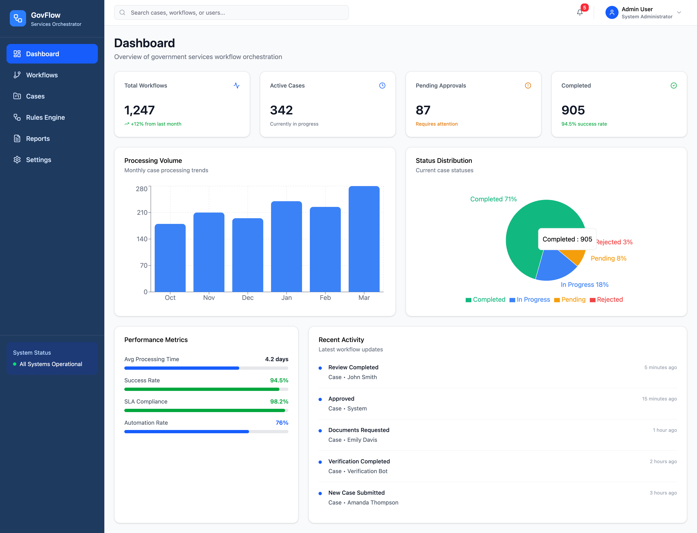
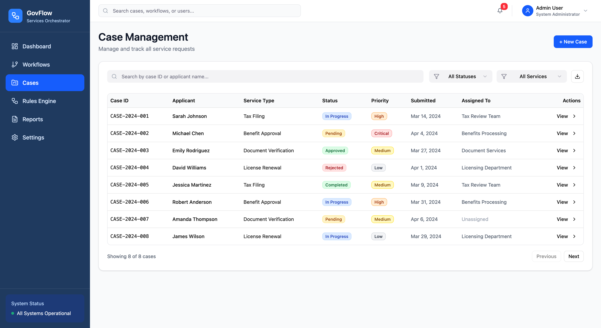
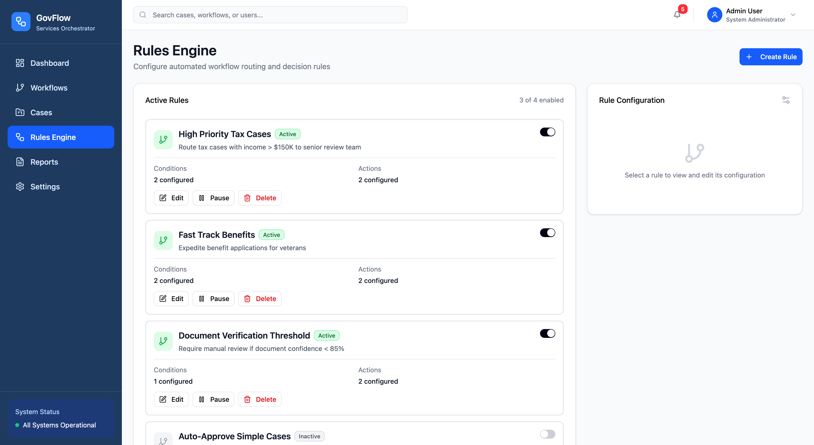
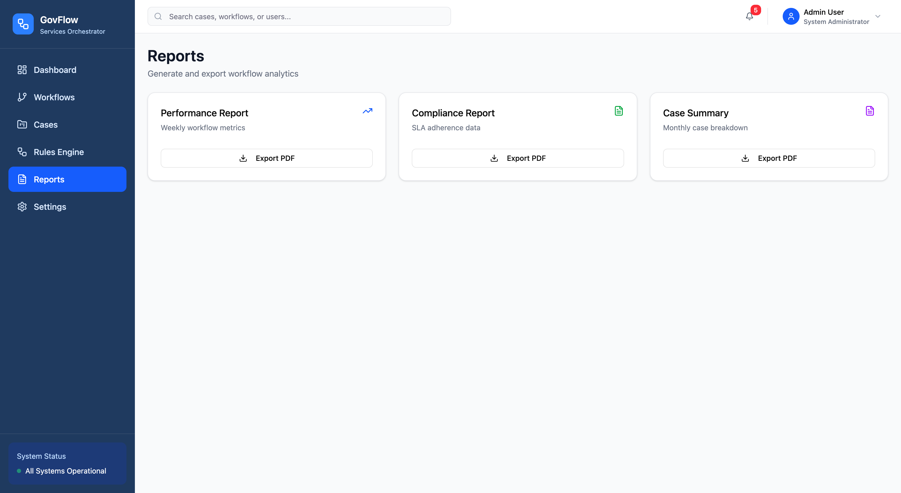

  # Government Services Workflow Orchestrator

  A scalable workflow orchestration system designed to automate and manage complex government service processes across multiple systems.

  ## Project Output

  
  
  
  
  

  ## Running the code

  Run `npm i` to install the frontend dependencies.

  Run `dotnet run` from `backend/GovernmentServices.WorkflowApi` to start the .NET backend on `http://localhost:5050`.

  Run `npm run dev` from the project root to start the Vite frontend. The frontend proxies `/api` requests to the backend automatically during development.

  ## Verification Bot

  The backend is wired to a lightweight Hugging Face Qwen model: `Qwen/Qwen2.5-0.5B-Instruct`.

  By default, the app falls back to a fast local heuristic verifier unless you explicitly enable the local Qwen model and have it cached already. To enable the model path, set `QWEN_ENABLE_LOCAL_MODEL=1` before starting the backend and make sure the Hugging Face model is available locally.

  Python dependencies for the verifier are listed in `backend/GovernmentServices.WorkflowApi/ml/requirements.txt`.
  
